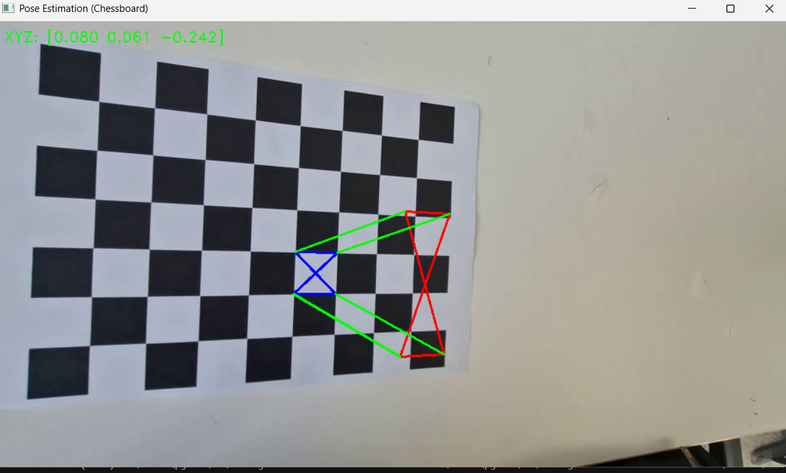
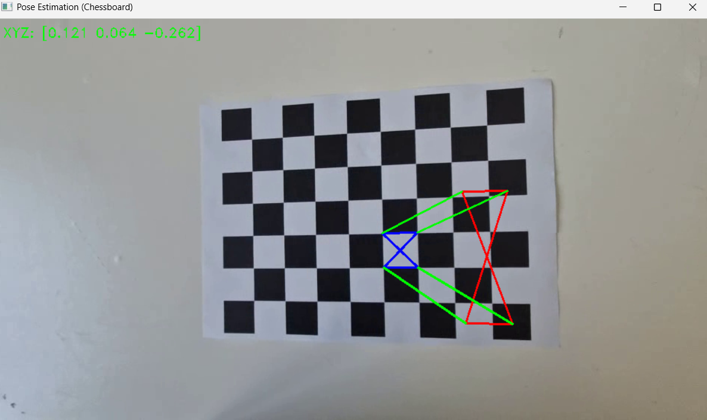
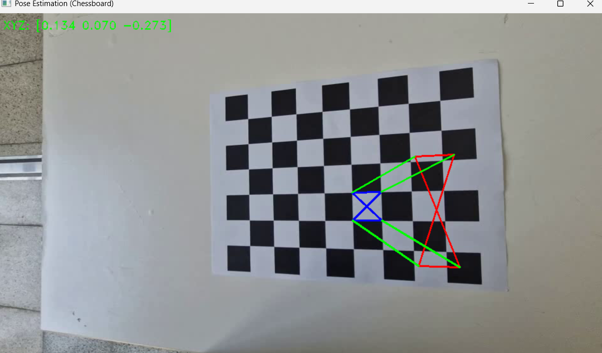
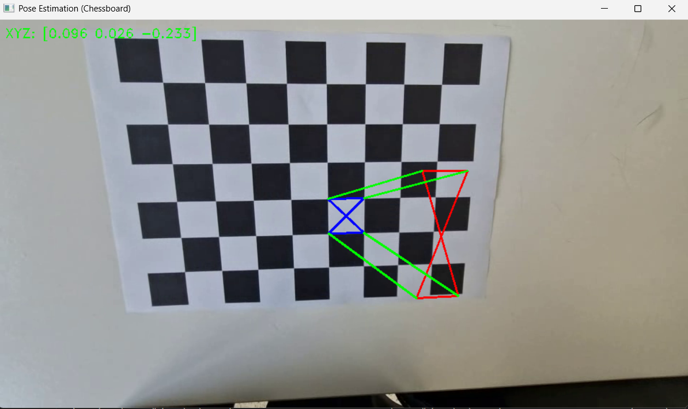

# AR-Object-Visualization
This is the AR object visualization program using open_cv

## Camera Caliberation 결과
* **Camera matrix (K):**
| | | |
|-|-|-|
|483.63276949|0|489.78786419|
|0|482.20222809|258.33907507|
|0|0|1|

* **Distortion Coefficient**

|k1|k1|p1|p2|k3|...|
|-|-|-|-|-|-|
|-0.0330968|0.1257044|0.00088757|0.00367228|-0.11900001|

### Object Visualization
* 사다리꼴 형 사각기둥 모양으로 변형 : x축 방향으로 늘어나고 높이는 2를 유지하고, 윗면의 면적이 더 넓어지도록 변형
* 스크린 샷

